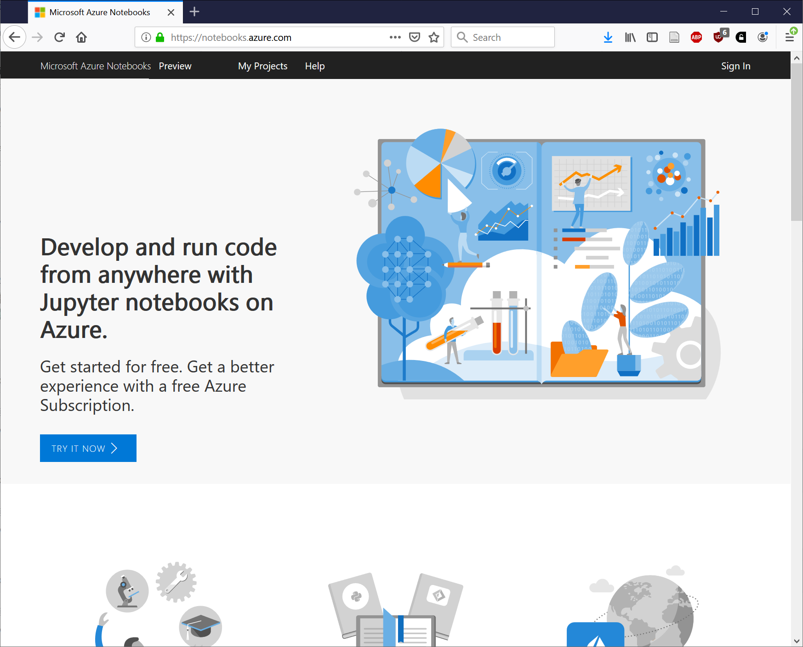
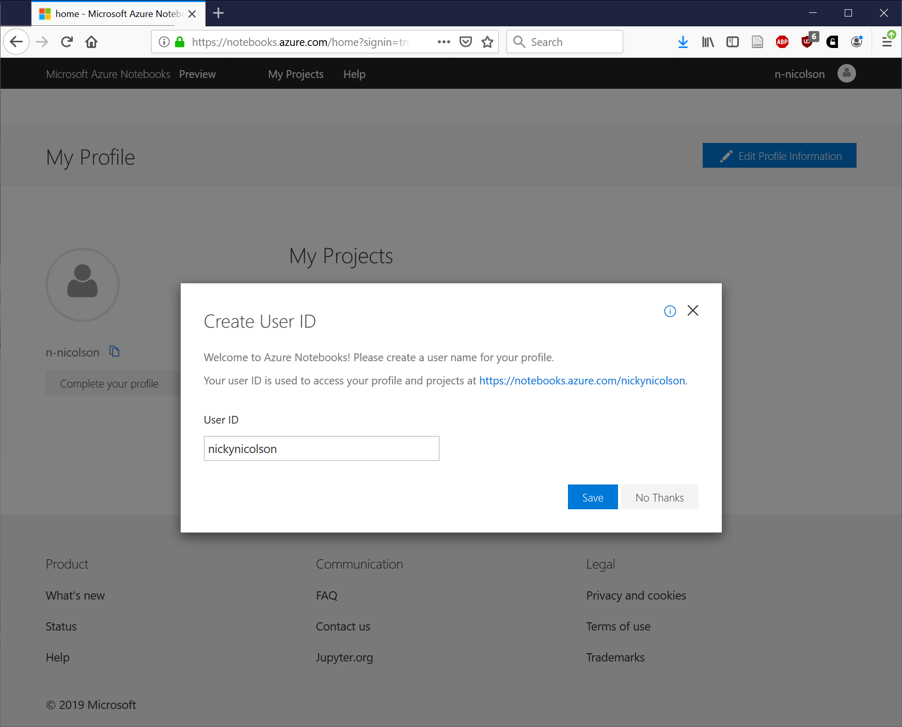
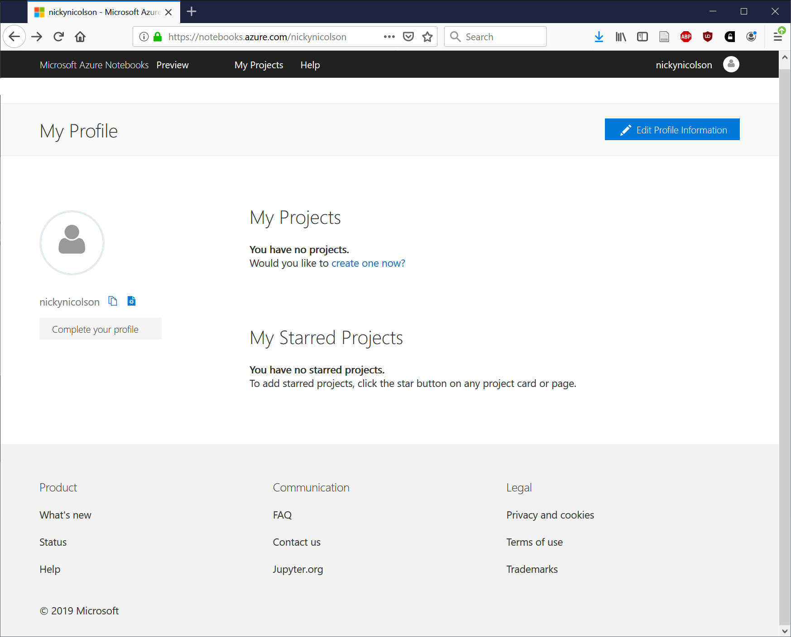
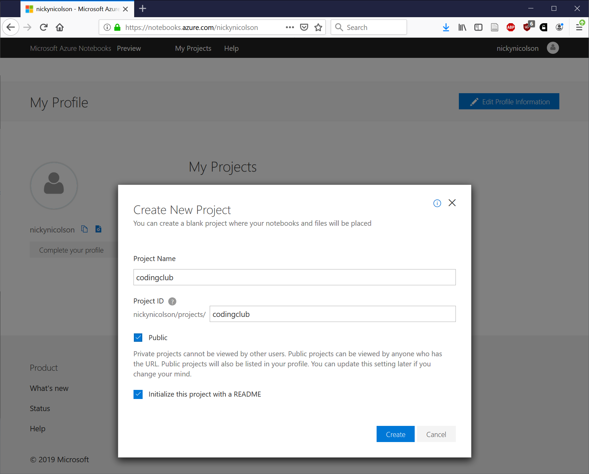
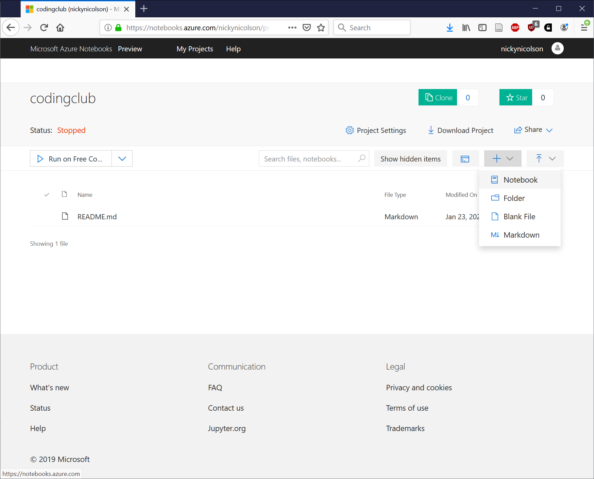
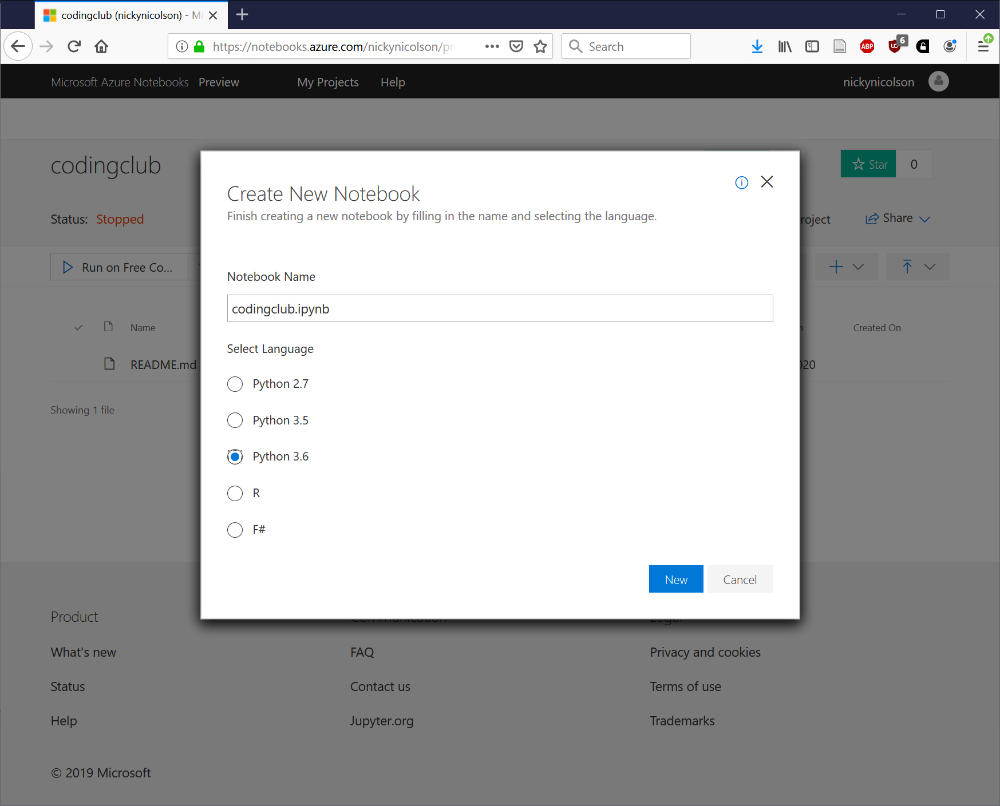
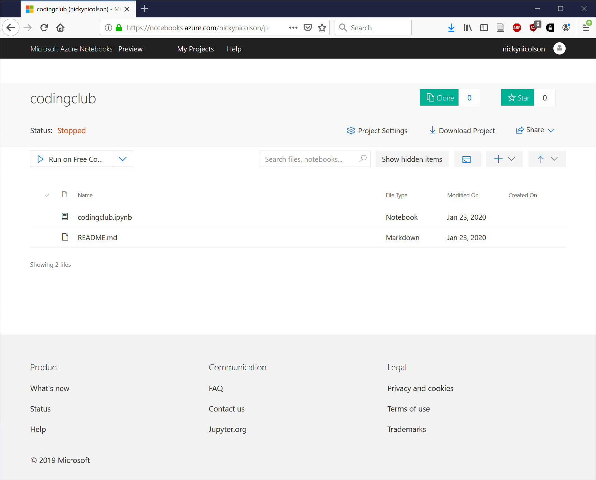
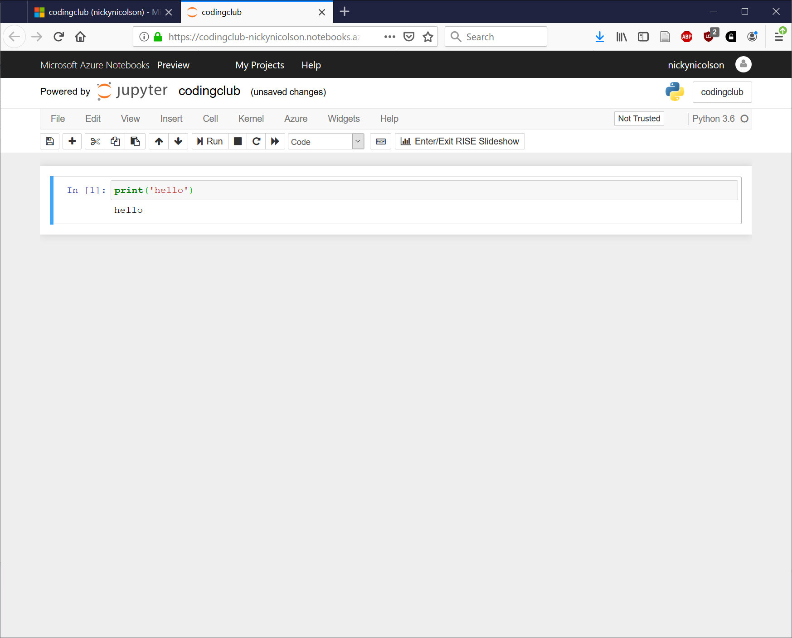

# Azure notebooks

A *notebook* is an interactive document that can hold both executable code sections and markdown (simple format) documentation. They are accessed in an interface that runs in a web browser, meaning you can have access to a programming environment with no local setup. Both ``R`` and ``Python`` languages are supported.

These instructions explain how to access the notebook environment provided by Microsoft at [notebooks.azure.com](http://notebooks.azure.com). Other similar environments are provided by e.g. Google, but as we use Microsoft Office 365 for mail at Kew, we can be sure that all attendees will have a Microsoft account.

1. Open https://notebooks.azure.com/ and click the "Sign in" link in the header. You'll need to authenticate via two factor authentication, so you'll need access to your device to receive the code.

#

2. Create your account - set your display name

#

3. You should now have a notebooks home page, which is empty - click to create a project

#

4. Create a project

#

5. Project homepage 

#

6. Add a new notebook to the project

#

7. Give it a name ``codingclub.ipynb`` and select language

#

8. Project file list

#

9. Clicking on ``codingclub.ipynb`` will open the notebook in Jupyter

#

10. You can type code into the first cell in the notebook, e.g. to say hello

#

